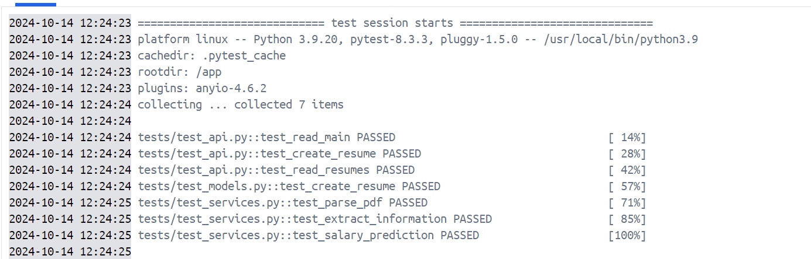

<<<<<<< HEAD
# My_first_data_project
=======
Анализатор резюме
Этот проект представляет собой веб-приложение для анализа резюме, которое включает в себя API на FastAPI, базу данных PostgreSQL и пользовательский интерфейс на Streamlit. Приложение позволяет загружать резюме в формате PDF, извлекать из них информацию, сохранять данные в базе данных и предоставлять аналитику на основе загруженных резюме.
Структура проекта
Copy[app]
├── [database]
│   ├── database.py
│   ├── test_database.py
│   └── __init__.py
├── main.py
├── [models]
│   ├── resume.py
│   └── __init__.py
├── [routes]
│   ├── resume.py
│   └── __init__.py
├── [schemas]
│   ├── resume.py
│   └── __init__.py
├── [services]
│   ├── [crud]
│   │   ├── resume.py
│   │   └── __init__.py
│   ├── pdf_parser.py
│   ├── salary_predictor.py
│   └── __init__.py
└── __init__.py
[docs]
[nginx]
│   └── nginx.conf
[tests]
│   ├── conftest.py
│   ├── sample_resume.pdf
│   ├── test_api.py
│   ├── test_models.py
│   ├── test_services.py
│   └── __init__.py
[webview]
│   └── streamlit_app.py
docker-compose.yml
Dockerfile
README.md
requirements.txt
stacking_model.pkl
Основные компоненты

FastAPI Backend (app/): Обрабатывает запросы API, взаимодействует с базой данных и выполняет анализ резюме.
PostgreSQL Database: Хранит данные о резюме и результаты анализа.
Streamlit Frontend (webview/streamlit_app.py): Предоставляет пользовательский интерфейс для загрузки резюме и просмотра аналитики.
Nginx: Выступает в качестве обратного прокси-сервера.
Docker: Обеспечивает контейнеризацию приложения для удобного развертывания.

Как это работает
Загрузка и анализ резюме

Пользователь загружает PDF-файл резюме через интерфейс Streamlit.
Файл отправляется в FastAPI backend через POST-запрос к эндпоинту /api/v1/resumes/upload.
Backend использует pdf_parser.py для извлечения текста и информации из PDF.
Извлеченная информация сохраняется в базе данных PostgreSQL.
salary_predictor.py использует машинное обучение для прогнозирования зарплаты на основе данных резюме.

Просмотр аналитики

Streamlit frontend отправляет GET-запрос к /api/v1/resumes/ для получения всех резюме.
Backend извлекает данные из базы данных и отправляет их обратно в формате JSON.
Streamlit создает визуализации и отображает статистику на основе полученных данных.

Основные файлы и их функции

app/main.py: Точка входа для FastAPI приложения.
app/database/database.py: Настройка подключения к базе данных.
app/models/resume.py: Определение модели данных для резюме.
app/routes/resume.py: Определение API-маршрутов для операций с резюме.
app/schemas/resume.py: Схемы Pydantic для валидации данных.
app/services/crud/resume.py: CRUD-операции для работы с резюме в базе данных.
app/services/pdf_parser.py: Парсинг PDF-файлов и извлечение информации.
app/services/salary_predictor.py: Прогнозирование зарплаты на основе данных резюме.
webview/streamlit_app.py: Streamlit приложение для пользовательского интерфейса.
Dockerfile: Инструкции для сборки Docker-образа.
docker-compose.yml: Конфигурация для запуска многоконтейнерного приложения.
nginx/nginx.conf: Конфигурация Nginx.

Запуск проекта

Убедитесь, что у вас установлены Docker и Docker Compose.
Клонируйте репозиторий:
Copygit clone <url-репозитория>
cd <директория-проекта>

Запустите приложение с помощью Docker Compose:
Copydocker-compose up --build

Откройте браузер и перейдите по адресу http://localhost:8501 для доступа к Streamlit интерфейсу.

API Endpoints

POST /api/v1/resumes/: Создать новое резюме
GET /api/v1/resumes/: Получить список всех резюме
GET /api/v1/resumes/{resume_id}: Получить конкретное резюме по ID
PUT /api/v1/resumes/{resume_id}: Обновить резюме
DELETE /api/v1/resumes/{resume_id}: Удалить резюме
POST /api/v1/resumes/upload: Загрузить и проанализировать PDF-файл резюме

Тестирование
Для запуска тестов используйте следующую команду:
Copydocker-compose run test pytest
Безопасность

Все API-запросы проходят через Nginx, который выступает в качестве обратного прокси-сервера.
Используются переменные окружения для хранения конфиденциальной информации.
Реализована валидация данных с использованием Pydantic.

Масштабирование
Проект разработан с учетом возможности горизонтального масштабирования:

Можно увеличить количество экземпляров FastAPI приложения в docker-compose.yml.
PostgreSQL может быть заменен на кластерное решение для обработки большего объема данных.

Все pytests пройдены и, как продемонстрировано на консультации, программа позволяет без проблем выполнить прогноз.

>>>>>>> fe02a81 (Final changes)
